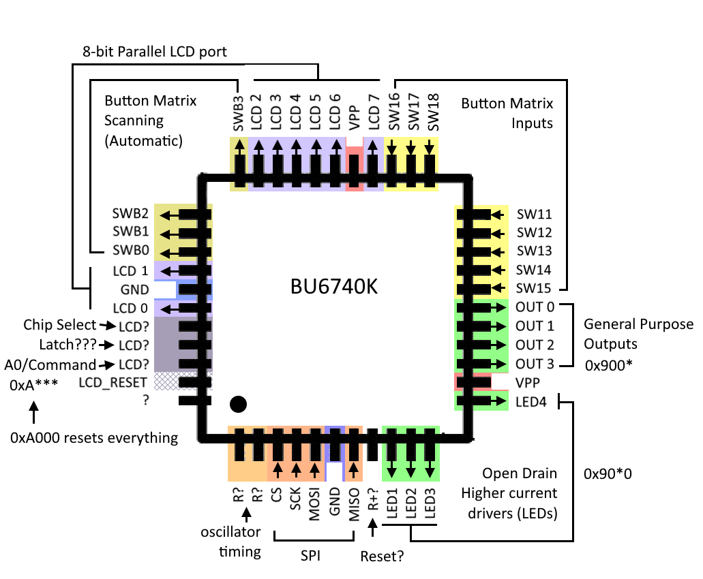

# BU6740AK
My own reverse engineering of the BU6740K/BU6740AK that HP used to employ for driving the UI board on some of their printers.
-
Other people have already done a huge part of the work:
- https://zukjeff.blogspot.com/2014/11/reverse-engineer-hp-lcd-protocol.html
- https://cocus.rf.gd/2017/05/04/hp-3550-glcd-hack/
- https://kbiva.wordpress.com/2013/04/19/hp-color-laserjet-1600-front-panel/
---
This is my take, with pinouts and headaches. My board uses a different display, so I tried to understand the IC better in orther to properly use it.

## Pinout

